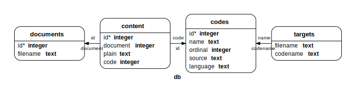

# Database
We use an SQLite database to manage document content. Using SQL requires a remapping of the available data.

``` {.haskell file=src/Database.hs}
{-# LANGUAGE DeriveGeneric, OverloadedLabels #-}
module Database where

<<database-imports>>
<<database-types>>
<<database-create>>
<<database-insertion>>
<<database-update>>
<<database-queries>>
```

## Types

We wrap all SQL interaction in a `SQL` monad, which stores the `Connection` object and a logger.

``` {.haskell #database-imports}
import Paths_entangled

import Database.SQLite.Simple
import Database.SQLite.Simple.FromRow

import Control.Monad.Reader
import Control.Monad.IO.Class
import Control.Monad.Catch
import Control.Monad.Writer
import Control.Monad.Logger

<<import-text>>
import qualified Data.Text.IO as T.IO
```

``` {.haskell #database-types}
newtype SQL a = SQL { unSQL :: ReaderT Connection (LoggingT IO) a }
    deriving (Applicative, Functor, Monad, MonadIO, MonadThrow, MonadLogger, MonadLoggerIO)

class (MonadIO m, MonadThrow m, MonadLogger m) => MonadSQL m where
    getConnection :: m Connection
    runSQL :: (MonadIO n, MonadLoggerIO n) => Connection -> m a -> n a

-- type LogLine = (Loc, LogSource, LogLevel, LogStr)

instance MonadSQL SQL where
    getConnection = SQL ask
    runSQL conn (SQL x) = do
        logFun <- askLoggerIO
        x <- liftIO $ runLoggingT (runReaderT x conn) logFun
        return x

withSQL :: (MonadIO m, MonadLoggerIO m) => FilePath -> SQL a -> m a
withSQL p (SQL x) = do
    logFun <- askLoggerIO
    x <- liftIO $ withConnection p (\conn -> liftIO $ runLoggingT (runReaderT x conn) logFun)
    return x

expectUnique :: (MonadThrow m, Show a) => [a] -> m (Maybe a)
expectUnique []  = return Nothing
expectUnique [x] = return $ Just x
expectUnique lst = throwM $ DatabaseError $ "duplicate entry: " <> tshow lst

expectUnique' :: (MonadThrow m, Show a) => (a -> b) -> [a] -> m (Maybe b)
expectUnique' _ []  = return Nothing
expectUnique' f [x] = return $ Just (f x)
expectUnique' _ lst = throwM $ DatabaseError $ "duplicate entry: " <> tshow lst
```

The `SQLite.Simple` function `withTransaction` takes an `IO` action as argument. We somehow have to redirect logging information around the unpacking to `IO` and lifting back to `MonadSQL`. This is not the prettiest solution, and we see some repetition of the pattern where we unpack result and log, forward log to outer monad and return result pattern.

All the `RedirectLog` code is needed to aid the type checker, or it won't know what to do.

``` {.haskell #database-types}
withTransactionM :: (MonadSQL m, MonadLoggerIO m) => m a -> m a
withTransactionM t = do
    conn <- getConnection
    logFun <- askLoggerIO
    x <- liftIO $ withTransaction conn (runLoggingT (runSQL conn t) logFun)
    return x
```

``` {.haskell #database-imports}
<<import-map>>
import Data.Maybe (catMaybes)
import Data.Int (Int64)

import Document
import Config
import TextUtil
```

::: {.note}
use `pragma foreign_keys = true`.
:::

A diagram for this schema, generated with `sqleton`. It would be awesome if the following would work.

``` {.make #-knit- .-hidden-}
schema.svg: <<file|schema>>
    cat $< | sqlite3 database
    sqleton -o $@ database -e -L circo 
```



In `SQLite.Simple` the above schema becomes

``` {.sqlite file=data/schema.sql}
-- rules when editing this schema:
-- * always use double quotes for identifiers,
-- * align types for easy reading
pragma synchronous = off;
pragma journal_mode = memory;
pragma foreign_keys = on;

<<schema>>
-- vim:ft=mysql
```

::: {.TODO}
Implement the interface in Selda.
:::

## Create database

``` {.haskell #database-create}
schema :: IO [Query]
schema = do
    schema_path <- getDataFileName "data/schema.sql"
    qs <-  T.splitOn ";" <$> T.IO.readFile schema_path
    return $ map Query (init qs)

createTables :: SQL ()
createTables = do
    conn <- getConnection
    liftIO $ schema >>= mapM_ (execute_ conn)
```

## Insertion

### Documents

``` {.sqlite #schema}
-- this table should be sorted on order of inclusion
create table if not exists "documents"
    ( "id"        integer primary key autoincrement
    , "filename"  text not null
    , "time"      timestamp default current_timestamp not null
    );
```

### Codes

The code table maps to a `ReferencePair` containing both `CodeBlock` and `ReferenceId`. I use the `name`, `ordinal` pair as primary key.

``` {.sqlite #schema}
create table if not exists "codes"
    ( "id"        integer primary key autoincrement
    , "name"      text not null
    , "ordinal"   integer not null
    , "source"    text not null
    , "language"  text not null
    , "document"  integer not null
    , foreign key ("document") references "documents"("id")
    );
```

``` {.haskell #database-insertion}
insertCode :: Int64 -> ReferencePair -> SQL ()
insertCode docId ( ReferenceId _ (ReferenceName name) count
                 , CodeBlock (KnownLanguage langName) attrs source ) = do
    conn <- getConnection
    liftIO $ do
        execute conn "insert into `codes`(`name`,`ordinal`,`source`,`language`,`document`) \
                     \ values (?,?,?,?,?)" (name, count, source, langName, docId)
        codeId <- lastInsertRowId conn
        executeMany conn "insert into `classes` values (?,?)"
                    [(className, codeId) | className <- getClasses attrs]
    where getClasses [] = []
          getClasses (CodeClass c : cs) = c : getClasses cs
          getClasses (_ : cs) = getClasses cs

insertCodes :: Int64 -> ReferenceMap -> SQL ()
insertCodes docId codes = mapM_ (insertCode docId) (M.toList codes)
```

A table that references specific code blocks should reference both the code name and the code ordinal.

``` {.sqlite #reference-code}
, "code"        text not null
, foreign key ("code") references "codes"("id") on delete cascade
```

### Classes and attributes

``` {.sqlite #schema}
create table if not exists "classes"
    ( "class"     text not null
    <<reference-code>>
    );

create table if not exists "attributes"
    ( "attribute"   text not null
    , "value"       text not null
    <<reference-code>>
    );
```


### Content

``` {.sqlite #schema}
create table if not exists "content"
    ( "id"          integer primary key autoincrement
    , "document"    integer not null
    , "plain"       text
    , "code"        integer
    , foreign key ("document") references "documents"("id")
    , foreign key ("code") references "codes"("id")
    );
    -- , check ("plain" is not null or ("codeName" is not null and "codeOrdinal" is not null)) )
```

``` {.haskell #database-insertion}
queryCodeId' :: Int64 -> ReferenceId -> SQL (Maybe Int64)
queryCodeId' docId (ReferenceId _ (ReferenceName name) count) = do
    conn <- getConnection
    expectUnique' fromOnly =<< (liftIO $ query conn codeQuery (docId, name, count))
    where codeQuery = "select `id` from `codes` where \
                      \ `document` is ? and `name` is ? and `ordinal` is ?"

queryCodeId :: ReferenceId -> SQL (Maybe Int64)
queryCodeId (ReferenceId doc (ReferenceName name) count) = do
    conn    <- getConnection
    expectUnique' fromOnly =<< (liftIO $ query conn codeQuery (doc, name, count))
    where codeQuery = "select `codes`.`id` \
                      \ from `codes` inner join `documents` \
                      \     on `documents`.`id` is `codes`.`document` \
                      \ where   `documents`.`filename` is ? \
                      \     and `name` is ? \
                      \     and `ordinal` is ?"

queryCodeSource :: ReferenceId -> SQL (Maybe Text)
queryCodeSource (ReferenceId doc (ReferenceName name) count) = do
    conn    <- getConnection
    expectUnique' fromOnly =<< (liftIO $ query conn codeQuery (doc, name, count))
    where codeQuery = "select `codes`.`source` \
                      \ from `codes` inner join `documents` \
                      \     on `documents`.`id` is `codes`.`document` \
                      \ where   `documents`.`filename` is ? \
                      \     and `name` is ? \
                      \     and `ordinal` is ?"

contentToRow :: Int64 -> Content -> SQL (Int64, Maybe Text, Maybe Int64)
contentToRow docId (PlainText text) = return (docId, Just text, Nothing)
contentToRow docId (Reference ref)  = do
    codeId' <- queryCodeId' docId ref
    case codeId' of
        Nothing     -> throwM $ DatabaseError $ "expected reference: " <> tshow ref
        Just codeId -> return (docId, Nothing, Just codeId)

insertContent :: Int64 -> [Content] -> SQL ()
insertContent docId content = do
    rows <- mapM (contentToRow docId) content
    conn <- getConnection
    liftIO $ executeMany conn "insert into `content`(`document`,`plain`,`code`) values (?,?,?)" rows
```

### Targets

``` {.sqlite #schema}
create table if not exists "targets"
    ( "filename"  text not null unique
    , "codename"  text not null
    , "language"  text not null
    , "document"  integer not null
    , "time"      timestamp default current_timestamp not null
    -- , foreign key ("codename") references "codes"("name")
    , foreign key ("document") references "documents"("id")
    );
```

``` {.haskell #database-insertion}
insertTargets :: Int64 -> FileMap -> SQL ()
insertTargets docId files = do
        conn <- getConnection
        -- liftIO $ print rows
        liftIO $ executeMany conn "insert into `targets`(`filename`,`codename`,`language`,`document`) values (?, ?, ?, ?)" rows
    where targetRow (path, (ReferenceName name, lang)) = (path, name, lang, docId)
          rows = map targetRow (M.toList files)
```

## Updating

### Tangle

When a Markdown source is written to, we first remove all data that was inserted from that document and then reinsert the new data. This is to prevent that code blocks remain from older versions. This problem could also be solved by a separate garbage collection step.

``` {.haskell #database-update}
getDocumentId :: FilePath -> SQL (Maybe Int64)
getDocumentId rel_path = do
        conn <- getConnection
        expectUnique' fromOnly =<< (liftIO $ query conn documentQuery (Only rel_path))
    where documentQuery = "select `id` from `documents` where `filename` is ?"

removeDocumentData :: Int64 -> SQL ()
removeDocumentData docId = do
    conn <- getConnection
    liftIO $ do
        execute conn "delete from `targets` where `document` is ?" (Only docId)
        execute conn "delete from `content` where `document` is ?" (Only docId)
        execute conn "delete from `codes` where `document` is ?" (Only docId)

insertDocument :: FilePath -> Document -> SQL ()
insertDocument rel_path Document{..} = do
    conn <- getConnection
    docId' <- getDocumentId rel_path
    docId <- case docId' of
        Just docId -> do
            logInfoN $ "Replacing '" <> T.pack rel_path <> "'."
            removeDocumentData docId >> return docId
        Nothing    -> do
            logInfoN $ "Inserting new '" <> T.pack rel_path <> "'."
            liftIO $ execute conn "insert into `documents`(`filename`) values (?)" (Only rel_path)
            liftIO $ lastInsertRowId conn
    insertCodes docId references
    insertContent docId documentContent
    insertTargets docId documentTargets
```

### Stitch

::: {.TODO}
Make this update more efficient. See https://stackoverflow.com/questions/11563869/update-multiple-rows-with-different-values-in-a-single-sql-query for an example.
Other performance related post: https://stackoverflow.com/questions/1711631/improve-insert-per-second-performance-of-sqlite
:::

``` {.haskell #database-update}
fromMaybeM :: Monad m => m a -> m (Maybe a) -> m a
fromMaybeM whenNothing x = do
    unboxed <- x
    case unboxed of
        Nothing -> whenNothing
        Just x' -> return x'

updateCode :: ReferencePair -> SQL ()
updateCode (ref, CodeBlock {codeSource}) = do
    codeId <- fromMaybeM (throwM $ DatabaseError $ "could not find code '" <> tshow ref <> "'")
                         (queryCodeId ref)
    conn   <- getConnection
    liftIO $ execute conn "update `codes` set `source` = ? where `id` is ?" (codeSource, codeId)

updateTarget :: [ReferencePair] -> SQL () 
updateTarget refs = withTransactionM $ mapM_ updateCode refs
```

## Queries

``` {.haskell #database-queries}
listTargetFiles :: SQL [FilePath]
listTargetFiles = do
    conn <- getConnection
    map fromOnly <$>
        liftIO (query_ conn "select `filename` from `targets`" :: IO [Only FilePath])
```

``` {.haskell #database-queries}
listSourceFiles :: SQL [FilePath]
listSourceFiles = do
    conn <- getConnection
    map fromOnly <$>
        liftIO (query_ conn "select `filename` from `documents`" :: IO [Only FilePath])
```

``` {.haskell #database-queries}
queryTargetRef :: FilePath -> SQL (Maybe (ReferenceName, Text))
queryTargetRef rel_path = do
    conn <- getConnection
    val  <- expectUnique =<< (liftIO $ query conn targetQuery (Only rel_path))
    return $ case val of
        Nothing           -> Nothing
        Just (name, lang) -> Just (ReferenceName name, lang)
    where targetQuery = "select `codename`,`language` from `targets` where `filename` is ?" 
```

``` {.haskell #database-queries}
stitchDocument :: FilePath -> SQL Text
stitchDocument rel_path = do
    conn <- getConnection
    docId <- getDocumentId rel_path >>= \case
        Nothing -> throwM $ StitchError $ "File `" <> T.pack rel_path <> "` not in database."
        Just x  -> return x
    result <- liftIO (query conn "select coalesce(`plain`,`codes`.`source`) from `content` \
                                 \  left outer join `codes` \
                                 \    on `code` is `codes`.`id` \
                                 \  where `content`.`document` is ?" (Only docId) :: IO [Only Text])
    return $ unlines' $ map fromOnly result
```

### References

``` {.haskell #database-queries}
queryReferenceMap :: Config -> SQL ReferenceMap
queryReferenceMap config = do
        conn <- getConnection
        rows <- liftIO (query_ conn "select `documents`.`filename`, `name`, `ordinal`, `source`, `language` from `codes` inner join `documents` on `codes`.`document` is `documents`.`id`" :: IO [(FilePath, Text, Int, Text, Text)])
        M.fromList <$> mapM (refpair config) rows
    where refpair config (rel_path, name, ordinal, source, lang) =
            case (languageFromName config lang) of
                Nothing -> throwM $ DatabaseError $ "unknown language: " <> lang
                Just l  -> return ( ReferenceId rel_path (ReferenceName name) ordinal
                                  , CodeBlock (KnownLanguage lang) [] source )
```

### Document

