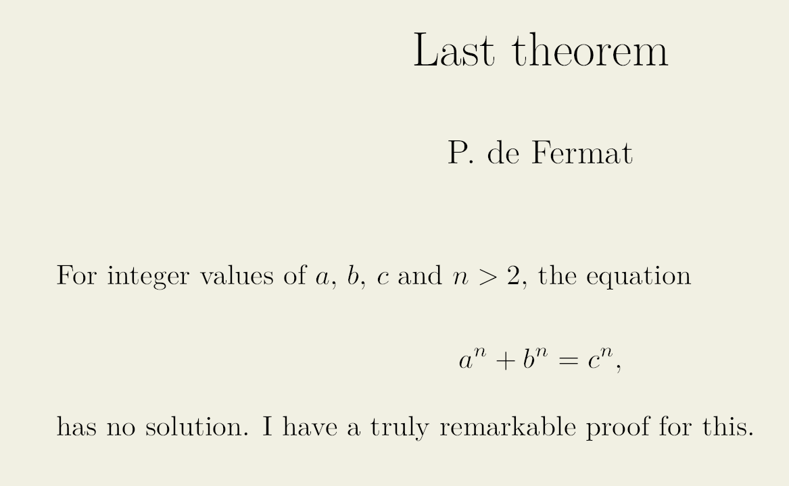

# All you'll ever need is Markdown
Markdown is widely used for writing up documents. It is supported by many blog engines, GitHub readme, you name it. There are many varieties, dialects and extensions to Markdown. The standard is described on the Daring Fireball website. One place where many flavours of Markdown meet is in Pandoc. Pandoc can convert Markdown to many different formats like HTML, LaTeX, PDF (through LaTeX), RTF, DOC, EPUB and even back to Markdown of a different flavour. There are some little known features (or extensions) of Markdown that make it very versatile and suitable for any rich text content, especially if you use Pandoc.

The take-away message is: you will never again have to write a document in LaTeX or HTML directly, not for writing notes, reports or papers, no power-point for presentations, no awkward WYSIWYG editor for web content (I'm talking to you Medium!); just use Markdown.
You might ask "But Johan, how do I then ...?", shush! The answer is always going to be: **Pandoc**.

## Primer
Markdown is a way of writing up rich content (i.e. text, document hierarchy, images, lists, quotes, etc.) in plain text using a human readable format. The format is aimed to mimic in plain text the formatted result:

~~~markdown
Level 1 Header
==============
Lorem ipsum dolor sit amet, consectetur adipiscing elit, sed do 
eiusmod tempor incididunt ut labore et dolore magna aliqua.

Level 2 Header
--------------
Ut enim ad minim veniam, quis nostrud exercitation ullamco laboris 
nisi ut aliquip ex ea commodo consequat.

* list item
* Another item

## Also a Level 2 Header
Duis aute irure dolor in reprehenderit in voluptate velit esse cillum dolore eu fugiat nulla pariatur.
> quote: Excepteur sint occaecat cupidatat non proident, sunt in 
> culpa qui officia deserunt mollit anim id est laborum
~~~

You can read Daring Fireball for more syntax. The basics of Markdown are highly intuitive, but in many instances standard Markdown does not suffice: there is no support for equations, citation management, cross references or numbered figures. However, Pandoc supports many extensions and flavours of Markdown that have evolved over the years. Markdown feels a bit like a natural language. This has lead to some [critique on the use of Markdown in technical documents](https://www.ericholscher.com/blog/2016/mar/15/dont-use-markdown-for-technical-docs/).

I will highlight some extensions, all clearly documented and supported by Pandoc, that transform Markdown into a versatile and extendable format, suitable for even the most technical and demanding documents, yet easy to use when no such demands arise.

## Flavours and extensions
There are many extensions to Markdown, some of which are more widely used than others. One of the most influential flavour of Markdown is the superset by Github, its major addition being that of delimited code blocks.

~~~markdown
```javascript
var factorial = n => (n < 2) ? 1 : n * factorial(n - 1);
```
~~~

### Attributes
Nothing good ever comes from PHP, except for PHP Markdown, which adds attributes to Markdown. Any element in a Markdown document can be adorned with (CSS style) attributes by appending them in curly braces: `{#id .class .class key=value}`. For example,

~~~markdown
## The proof {#proof .section color=red}
~~~

when converted to HTML looks like

~~~html
<h2 id="proof" class="section" color="red">The proof</h2>
~~~

or to LaTeX

~~~latex
\hypertarget{proof}{%
\subsection{The proof}\label{proof}}
~~~

In the case of LaTeX, the color attribute as well as the class is ignored, because Pandoc (by default) doesn't know what to do with it. The #proof id attached to this header can be used further on in the document to make cross-references.

The attribute syntax also applies to code blocks: a line starting with `\`\`\`python` is equivalent to `\`\`\` {.python}`.

### DIV elements
A `<div>` element can be added using three (or more) colons.

~~~markdown
::: {.warning}
This is a warning!
:::
~~~

This can be used to write down any non-standard element. So how is this rendered? If your output format is HTML, change the style sheet. For generating LaTeX however we need to do a bit more work. This is where Pandoc comes in. Pandoc has support for filtering elements and creating relevant output, but we'll get back to that.

### YAML metadata
Information that is usually contained in a HTML `<header>` region can be included in the YAML metadata block. This is a block delimited by hyphens at the top of the document.

~~~markdown
---
title: A theorem on right angled triangles
author: Pythagoras of Samos
date: ~520 BC, a hot summer night
---
~~~

This is also the place where you can configure options for Pandoc and its filters.

### Citations
Citations are managed using the pandoc-citeproc plugin. For those who have worked with BibTeX (or another bibliography database) before, you include the bibliography by adding a line to the YAML header block. Say you have stored your references in ref.bib , and want to create a dedicated section called "References" to list the citations:

~~~markdown
---
bibliography: ref.bib
reference-section-title: References
---
~~~

There are many ways to cite papers, the syntax for which is documented in the Pandoc manual. Basic citation looks like `[@Hidding2014]`, where `Hidding2014` is an entry in the bibliography. Several editors (VSCode and Emacs) even support autocompletion on the included bibliography.

### Equations
Equations can be entered using the famous LaTeX DSL for equations. Use single $ characters to delimit an inline equation and double $$ to delimit a full width equation.

~~~markdown
Given a right angled triangle of sides $a$, $b$ and hypotenuse $c$, we may state that,
$$a^2 + b^2 = c^2.$$
~~~

When converting to a LaTeX based output this will work trivially. For HTML it is probably best to use MathJax, enabled in Pandoc with the `--mathjax` and `--standalone` flags.

I promised to show you how Markdown can be extended with arbitrary functionality using Pandoc. It is inevitable that I will get a bit more technical here, but the rewards are high.

## Pandoc basics
Pandoc reads and writes documents of many formats. It does so by converting to and from a native intermediate representation. We'll create a document named last-theorem.md and enter the following:

~~~markdown
---
title: Last theorem
author: P. de Fermat
---

For integer values of $a$, $b$, $c$ and $n > 2$, the equation
$$a^n + b^n = c^n,$$
has no solution. I have a truly remarkable proof for this.
~~~

We can see how Pandoc reads a document by running
```
pandoc -f markdown+yaml_metadata_block -t native -s last-theorem.md
```
which will give (slightly edited for readability)

```haskell
Pandoc
 (Meta {unMeta = fromList
   [("author", MetaInlines [Str "P.",Space,Str "de",Space,Str "Fermat"])
   ,("title", MetaInlines [Str "Last",Space,Str "theorem"])]})
 [Para [Str "I",Space,Str "state",Space,Str "that,",Space
       ,Str "for",Space,Str "integer",Space,Str "values",Space
       ,Str "of",Space,Math InlineMath "a",Str ",",Space
       ,Math InlineMath "b",Str ",",Space
       ,Math InlineMath "c",Space,Str "and",Space
       ,Math InlineMath "n > 2"
       ,Str ",",Space,Str "the",Space,Str "equation"]
 ,Para [Math DisplayMath "a^n + b^n = c^n,"]
 ,Para [Str "has",Space,Str "no",Space,Str "solution.",Space
       ,Str "I",Space,Str "have",Space,Str "a",Space
       ,Str "truly",Space,Str "elegant",Space,Str "proof"
       ,Space,Str "for",Space,Str "this,",Space,Str "but",Space
       ,Str "this",Space,Str "is",Space,Str "not",Space
       ,Str "the",Space,Str "place",Space,Str "to",Space
       ,Str "give",Space,Str "it."]]
```

Yes, this is Haskell syntax. It just means what you think it means. Using native output in Pandoc will be very useful if you start developing your own filters. For now it just serves to illustrates how Pandoc works. If you're not a hacker, you'll never have to look at this again 🤓👍.

Let's create a PDF from this mathematics wizardry.

```
pandoc -f markdown+yaml_metadata_block -t latex -o last-theorem.pdf -s last-theorem.md
```

Resulting in a nice PDF rendering:



### Pandoc filters
There is a big problem with the above example. The equation is not numbered! Pandoc filters let you change the intermediate representation. Let's try the `pandoc-eqnos` filter. This filter is written in Python (using `pypandoc`); any language that can read the intermediate JSON representation works.

```
pip install --user pandoc-eqnos
```

We'll need to change the last-theorem.md document a bit. To get an equation numbered, add an `id` to the equation.

~~~markdown
$$a^n + b^n = c^n,$$ {#eq:fermat}
~~~

Also add a sentence to the end.

~~~markdown
The prove of inexistence of a solution for Equation @eq:fermat had eluded mathematicians for centuries.
~~~

Now to invoke the equation numbering filter, add the `--filter pandoc-eqnos` argument to the command line.

```
pandoc -f markdown+yaml_metadata_block -t latex --filter pandoc-eqnos -o last-theorem.pdf -s last-theorem.md
```


Pandoc command lines can grow out of hand rather quickly. It is advisable to manage your Pandoc settings in a Bash script or Make file, whatever you prefer.

### Lua filters
Pandoc has built-in support for filters written in Lua. Filters written in Lua are generally faster than those written in Python or other external languages. Lua filters forego documents being passed to an external program via JSON, but rather work directly on the abstract syntax tree as it is represented in Pandoc itself.

Let's add a feature. Add the following to our budding math paper:

~~~markdown
::: {.warning}
Modular forms and elliptic curves ahead!
:::
~~~

To parse this, Pandoc needs the extension `fenced_divs` enabled.

```
pandoc -f markdown+yaml_metadata_block+fenced_divs --filter pandoc-eqnos -t native -s last-theorem.md
```

At the end of the output will be the expression:

```haskell
Div 
 ("",["warning"],[])
 [Para [Str "Modular",Space,Str "forms",Space,Str "and",Space
 ,Str "elliptic",Space,Str "curves",Space,Str "ahead!"]]
```

Once we generate HTML from this example, we can add the proper CSS to the .warning class to change the looks of the warning. However, in the generated PDF there's no change. Let's make a filter that creates a nice coloured box in the LaTeX output. We define a filter that runs on all Div elements in the file `warning-div.lua`.

```lua
function Div(el)
  if el.classes[1] == "warning" then
    -- insert element in front
    table.insert(
      el.content, 1,
      pandoc.RawBlock("latex", "\\begin{warning}"))
    -- insert element at the back
    table.insert(
      el.content,
      pandoc.RawBlock("latex", "\\end{warning}"))
  end
  return el
end
```

The filter checks if the div has class `warning`, if so, it adds a LaTeX `RawBlock` at the start and end of the `div`.

Running Pandoc with `--lua-filter=warning-div.lua` now converts the div element to a LaTeX string

```latex
\begin{warning}
Modular forms and elliptic curves ahead!
\end{warning}
```

This is not standard LaTeX, so we'll need to define a macro in `warning.tex`:

```latex
\usepackage{tcolorbox}
\newenvironment{warning}
    {\begin{tcolorbox}[colbacktitle=red!50!white,
                       title=Warning,coltitle=black,
                       fonttitle=\bfseries]}
    {\end{tcolorbox}}
```

We can run Pandoc again to generate the PDF. The `-H` option can be used to include files into the generated output.

```
pandoc -f markdown+yaml_metadata_block+fenced_divs --filter pandoc-eqnos --lua-filter warning-div.lua -H warning.tex -t latex -o last-theorem.pdf -s last-theorem.md
```

Did I mention Pandoc command lines tend to grow out of hand?


## Skies and limits
Granted, to unlock the full power of Markdown for the web, you'll need to know some HTML and CSS, and to tweak PDF output to your impossibly high standards you need to grok LaTeX. All the more reason to create an ecosystem of scripts, themes and tutorials to ease the learning curve. Also, code editors should offer better support for more varieties of markdown. I don't mean cluttering up the editing experience with more distracting tool-tips, snippets etc. Just this: correct and efficient highlighting and proper outline support.

This was just a teaser of what is possible with Pandoc. Did I mention creating slide shows with `reveal.js`? Or how about doing some literate programming with `entangled`? The documentation of Pandoc is excellent, so just go ahead and write all your content in Markdown!
