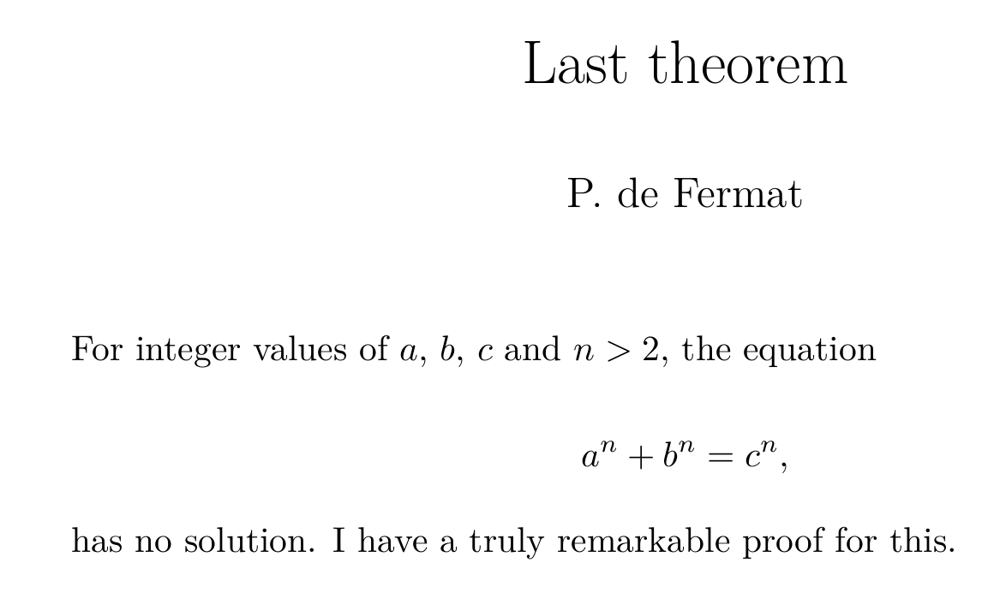
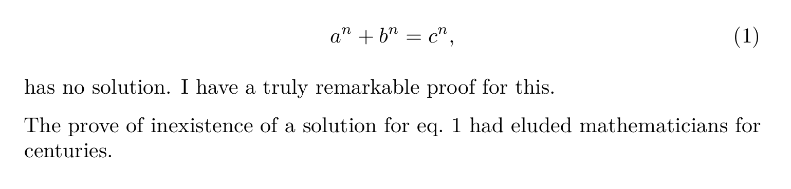
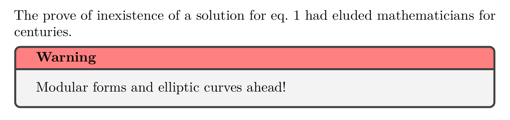

Markdown is widely used for writing up documents. It is supported by many blog engines, github readme, you name it. There are many varieties dialects and extensions to markdown. The quasi-standard is described on [the Daring Fireball website](https://daringfireball.net/projects/markdown/). One place where many flavours of markdown meet is in [Pandoc](https://pandoc.org). [Pandoc](https://pandoc.org) can convert markdown to many different formats like HTML, LaTeX, PDF (through LaTeX), RTF, DOC, EPUB and even back to markdown of a different flavour. There are some little known features of (extended) markdown that make it very versatile and applicable to any application needing some form of rich content management, especially if you use [Pandoc](https://pandoc.org).

The take-away message is: you will never again have to write a document in LaTeX or HTML directly, not for writing notes, reports or papers, no power-point for presentations, no awkward wysiwig editor for web content; just use markdown.

You might ask "But Johan, how do I then ...?", shush! The answer is always going to be: [**Pandoc**](https://pandoc.org).

## Primer

For those who have been living under the proverbial stone, markdown is a way of writing up rich content (i.e. text, document hierarchy, images, lists, quotes, etc.) in plain text using a human readable format. The format is aimed to mimick in plain text the formatted result:

~~~markdown
Level 1 Header
==============

Lorem ipsum dolor sit amet, consectetur adipiscing elit, sed do eiusmod tempor incididunt ut labore et dolore magna aliqua.

Level 2 Header
--------------

Ut enim ad minim veniam, quis nostrud exercitation ullamco laboris nisi ut aliquip ex ea commodo consequat.

* list item
* Another item

## Also a Level 2 Header

Duis aute irure dolor in reprehenderit in voluptate velit esse cillum dolore eu fugiat nulla pariatur.

> quote: Excepteur sint occaecat cupidatat non proident, sunt in culpa qui officia deserunt mollit anim id est laborum.
~~~

Read [Daring Fireball](https://daringfireball.net/projects/markdown/syntax) for more syntax.

### Flavours and extensions

There are many extensions to markdown, some of which are more widely used than others. I will highlight the most important ones for the purpose of my main message (expressing the awesomeness of Pandoc, if you missed it).

One of the most influencial flavour of markdown is the superset by Github, its major addition being that of delimited code blocks.

~~~markdown
```javascript
var factorial = n => (n < 2) ? 1 : n * factorial(n - 1);
```
~~~

### Attributes

Nothing good ever comes from PHP, except for PHP Markdown, which adds attributes to markdown.

Any element in a markdown document can be adorned with (CSS style) attributes by appending them in curly braces: `{#id .class .class key=value}`. This also applies to code blocks: a line starting with `` ```python`` is equivalent to `` ``` {.python}``.

### DIV elements

A `div` element can be added using three colons.

~~~markdown
::: {.warning}
This is a warning!
:::
~~~

This can be used to write down any non-standard element. So how is this rendered? This is where pandoc comes in. Pandoc has support for filtering elements and creating relevant output.

### YAML metadata

Information that is usually contained in a HTML `<header>` region can be included in the YAML metadata block. This is a block delimited by hyphens at the top of the document.

~~~markdown
---
title: A theorem on right angled triangles
author: Pythagoras of Samos
date: ~520 BC, a hot summer night
---
~~~

This is also the place where you can configure options for Pandoc and its filters.

### Equations

Equations can be entered using the LaTeX DSL for equations. Use single `$` characters to delimit an inline equation and double `$$` to delimit a full width equation.

~~~markdown
Given a right angled triangle of sides $a$, $b$ and hypothenuse $c$, we may state that,

$$a^2 + b^2 = c^2.$$
~~~

When converting to a LaTeX based output this will work trivially. For HTML it is probably best to use MathJax, enabled in Pandoc with the `--mathjax` and `--standalone` flags.

## Pandoc basics

Pandoc reads and writes documents of many formats. It does so by converting to and from a native intermediate representation. 

Create a document named `last-theorem.md` and enter the following:

```markdown
---
title: Last theorem
author: P. de Fermat
---

For integer values of $a$, $b$, $c$ and $n > 2$, the equation

$$a^n + b^n \neq c^n,$$

has no solution. I have a truly remarkable proof for this.
```

We can see how Pandoc reads a document by running

```shell
pandoc -f markdown+yaml_metadata_block -t native -s last-theorem.md
```

will give (slightly edited for readability)

```haskell
Pandoc
  (Meta {unMeta = fromList
         [("author", MetaInlines [Str "P.",Space,Str "de",Space,Str "Fermat"])
         ,("title",  MetaInlines [Str "Last",Space,Str "theorem"])]})
  [Para [Str "I",Space,Str "state",Space,Str "that,",Space,Str "for",Space
        ,Str "integer",Space,Str "values",Space,Str "of",Space
        ,Math InlineMath "a",Str ",",Space,Math InlineMath "b",Str ",",Space
        ,Math InlineMath "c",Space,Str "and",Space,Math InlineMath "n > 2"
        ,Str ",",Space,Str "the",Space,Str "equation"]
  ,Para [Math DisplayMath "a^n + b^n = c^n,"]
  ,Para [Str "has",Space,Str "no",Space,Str "solution.",Space,Str "I",Space
        ,Str "have",Space,Str "a",Space,Str "truly",Space,Str "elegant",Space
        ,Str "proof",Space,Str "for",Space,Str "this,",Space,Str "but",Space
        ,Str "this",Space,Str "is",Space,Str "not",Space,Str "the",Space
        ,Str "place",Space,Str "to",Space,Str "give",Space,Str "it."]]
```

Yes, this is Haskell syntax. It just means what you think it means. Using native output in Pandoc will be very useful if you start developing your own filters. For now it just serves to illustrates how Pandoc works. If you're not a hacker, you'll never have to look at this again 🤓👍.

Let's create a PDF from this mathematics wizardry.

```shell
pandoc -f markdown+yaml_metadata_block -t latex -o last-theorem.pdf -s last-theorem.md
```

Resulting in a nice PDF rendering:



## Pandoc filters

There is a big problem with the above example. The equation is not numbered.
Pandoc filters let you change the intermediate representation. Let's try the [`pandoc-eqnos`](https://github.com/tomduck/pandoc-eqnos) filter. This filter is written in Python (using `pypandoc`); any language is possible.

```shell
pip install --user pandoc-eqnos
```

We'll need to change the `last-theorem.md` document a bit. Add an id to the equation.

```markdown
$$a^n + b^n = c^n,$$ {#eq:fermat}
```

Also add a sentence to the end.

```markdown
The prove of inexistence of a solution for +@eq:fermat had eluded mathematicians for centuries.
```

Now inspect the resulting native representation, add the `--filter pandoc-eqnos` arguments to the command line.

```shell
pandoc -f markdown+yaml_metadata_block --filter pandoc-eqnos -t native -s last-theorem.md
```

Or create the updated PDF.

```shell
pandoc -f markdown+yaml_metadata_block -t latex --filter pandoc-eqnos -o last-theorem.pdf -s last-theorem.md
```



Pandoc command lines can grow out of hand rather quickly. It is advisable to manage your Pandoc settings in a Bash script or Make file, whatever you prefer.

## Lua filters

Pandoc has built-in support for filters written in Lua. Filters written in Lua are generally faster than those written in Python or other external languages. Lua filters forego documents being passed to an external program via JSON, but rather work directly on the abstract syntax tree as it is represented in Pandoc itself.

Let's add a feature. Add the following to our budding math paper:

```markdown
::: {.warning}
Modular forms and elliptic curves ahead!
:::
```

To parse this, Pandoc needs the extension `fenced_divs` enabled.

```shell
pandoc -f markdown+yaml_metadata_block+fenced_divs --filter pandoc-eqnos -t native -s last-theorem.md
```

At the end of the output will be the expression:

```haskell
Div 
  ("",["warning"],[])
  [Para [Str "Modular",Space,Str "forms",Space,Str "and",Space
        ,Str "elliptic",Space,Str "curves",Space,Str "ahead!"]]
```

If we generate HTML from this example, we can add the proper CSS to the `.warning` class to change the looks of the warning. If we look at the generated PDF however, there's no change. Let's change this. We define a filter that runs on all `div` elements

``` {.lua file=warning-div.lua}
function Div(el)
    <<filter-body>>
end
```

The filter checks if the `div` has class `warning`; if not, don't change a thing.

``` {.lua #filter-body}
    if el.classes[1] == "warning" then
        <<generate-latex>>
    else
        return el
    end
```

We have to convert the contents of the `div` to a raw string, and create a `RawBlock` for LaTeX.


``` {.lua #generate-latex}
el.content = [
    pandoc.RawBlock("latex", "\\begin{warning}"), 
    pandoc.Para(el.content),
    pandoc.RawBlock("latex", "\\end{warning}") ]
```

Running Pandoc with `--lua-filter=warning-div.lua` now converts the `div` element to a raw LaTeX string 

```latex
\begin{warning}Modular forms and elliptic curves ahead!\end{warning}
```

This is not standard LaTeX, so we'll need to define a macro

``` {.latex file=warning.tex}
\usepackage{tcolorbox}
\newenvironment{warning}
    {\begin{tcolorbox}[colbacktitle=red!50!white,
                       title=Warning,coltitle=black,
                       fonttitle=\bfseries]}
    {\end{tcolorbox}}
```

We can run Pandoc again to generate the PDF. The `-H` option can be used to add files to the preamble.

```shell
pandoc -f markdown+yaml_metadata_block+fenced_divs --filter pandoc-eqnos --lua-filter warning-div.lua -H warning.tex -t latex -o last-theorem.pdf -s last-theorem.md
```



## Conclusion

Granted, to unlock the full power of markdown for the web, you'll need to know some HTML and CSS, and to tweak PDF output to your impossibly high standards you need to grok LaTeX. All the more reason to create an ecosystem of scripts, themes and tutorials to ease the learning curve. Also, code editors should offer better support for more varieties of markdown. I don't mean cluttering up the editing experience with more distracting tool-tips, snippets etc. Just this: correct and efficient highlighting and proper outline support.

